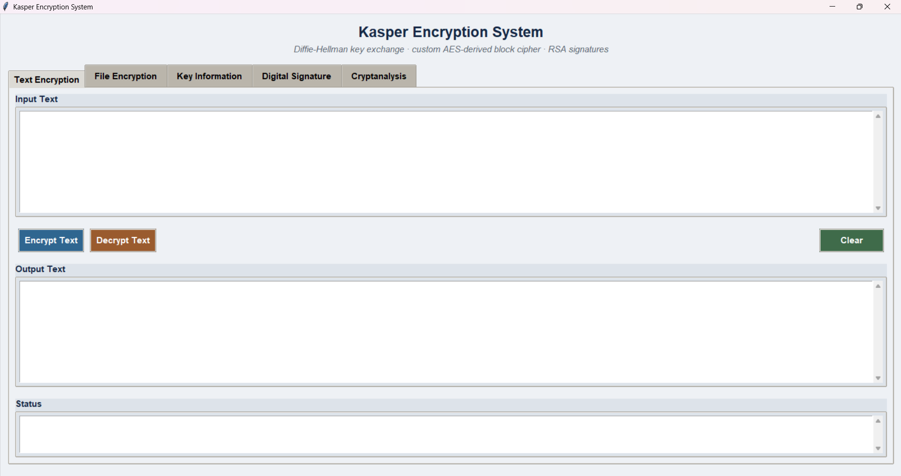
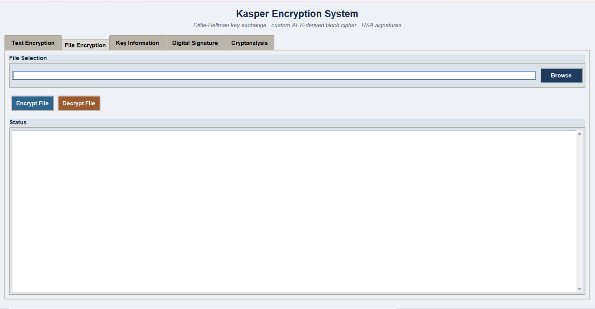
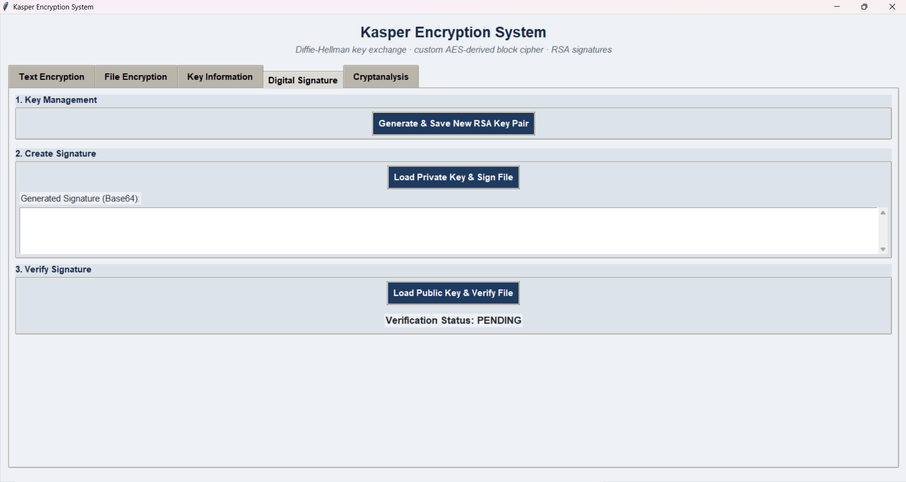

# Kasper Encryption System


## 📌 Overview
The **Kasper Encryption System** is a custom cryptographic suite and research-oriented desktop application developed by Hamdan. It combines a secure Diffie-Hellman key exchange protocol with a custom AES-derived substitution-permutation block cipher, RSA-based digital signatures, and built-in cryptanalysis tools (avalanche effect testing and performance benchmarking against standard AES).

## 🖥️ Graphical User Interface (GUI) Showcase

The application features a clean, tactical desktop interface built with Python's Tkinter framework, organized across five core modules:

### 1. Text Encryption & Decryption
* **Description:** Provides real-time encryption and Base64 encoding/decryption for text strings using the custom Kasper block cipher and CBC mode.
<div align="center">
  
</div>

### 2. File Encryption
* **Description:** Securely encrypts and decrypts local files on disk utilizing the derived symmetric key and salt storage.
<div align="center">
  
</div>

### 3. Key Information & Configuration
* **Description:** Displays live cryptographic key material including Diffie-Hellman public/private keys, shared secrets, Base64 salts, derived hex keys, and architectural implementation specs.
<div align="center">
  
</div>

### 4. Digital Signatures (RSA)
* **Description:** Manages RSA-256 key pair generation, file signing via PSS padding, and signature verification.
<div align="center">
  
</div>

### 5. Cryptanalysis & Performance Suite
* **Description:** Evaluates cipher strength through automated avalanche effect tests (single-bit plaintext and key perturbation tracking) and benchmarks throughput (MB/s) against OpenSSL's AES-256-CBC implementation.
<div align="center">
  
</div>

## ✨ Core Features

* **Custom Block Cipher:** 128-bit block size utilizing custom S-boxes, a byte-rotation permutation layer, and a Galois-field GF(2^8) MDS matrix mixing layer (AES MixColumns) for robust diffusion.
* **Key Negotiation & Derivation:** Diffie-Hellman key exchange paired with PBKDF2-HMAC-SHA256 (100,000 iterations).
* **Digital Signatures:** RSA key generation, PEM serialization, and PSS-padded SHA-256 signing/verification.
* **Built-in Research Tooling:** Empirical avalanche effect verification and comparative performance metrics against hardware-accelerated AES.

## 📋 Prerequisites

Before running the system, ensure your environment has:
* **Python**: v3.8 or higher
* **Cryptography Library**: Python package for cryptographic primitives (`cryptography`)

## 🛠️ Installation & Setup

### Step 1: Clone the Repository
```bash
git clone https://github.com/MuhammadHamdan35/kasper-encryption-system.git
cd kasper-encryption-system
```

### Step 2: Install Dependencies
Install the required Python packages using pip:
```bash
pip install cryptography
```

### Step 3: Launch the Application
Run the main script to open the desktop GUI console:
```bash
python Kasper Encryption System.py
```

## 👨‍💻 Author

**Hamdan**
* BS Cyber Security Undergraduate
* Specializing in applied cryptography, custom cipher design, and security engineering.
